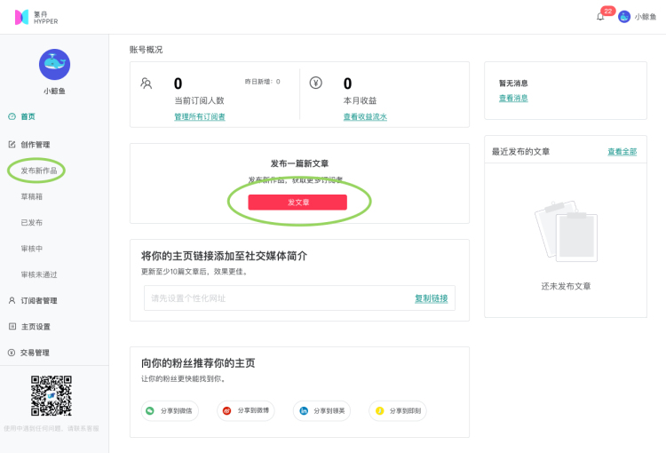
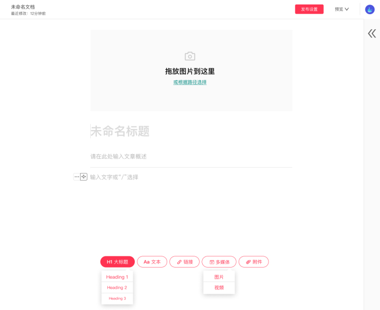
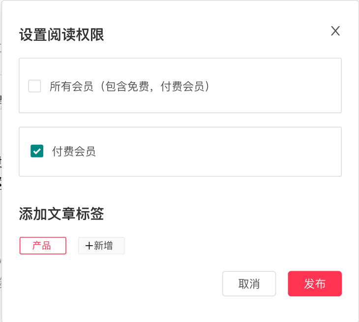

# 创作简报\(newsletter\)

#### 使用Newsletter创作内容 

**1. 进入编辑器**

进入氢舟网站Hypper.cn，点击后台管理中的“发布新作品”或者“发布新文章”，进入编辑器。

**2.使用编辑器创作**

编辑器支持上传题图，填写标题，文章概述，上传附件等，灵活创作内容。从第一篇文章开始，恭喜你正式迈入创作者的队伍中，享受创作的乐趣。

  
创作完毕后，为文章设置阅读权限，添加文章标签，点击发布，提交审核。审核成功后文章将自动推送给订阅过你的会员。

  
发布作品前，你还可以先预览页面，或将预览页面发送给朋友一起找BUG。

创建过程中遇到的问题可在创作者后台微信扫描客服小鲸二维码，或添加小鲸微信“pathway2020”咨询。

**3.经营管理**

全方位管理所有环节，在管理后台你可以：

**01.创作管理：**置顶发布过的文章，继续编辑草稿箱里的文章，查看审核中的文章。审核没通过的文章也可以继续编辑。

**02.订阅者管理：**查看总订阅人数，查看新增订阅人数，查看订阅者信息。

**03.交易管理：**查看流水，订单详情，收益。

**04.经营洞察：**分析实时数据，深入了解你的订阅者。获取与你的创作相关的详细信息，快速成长。

