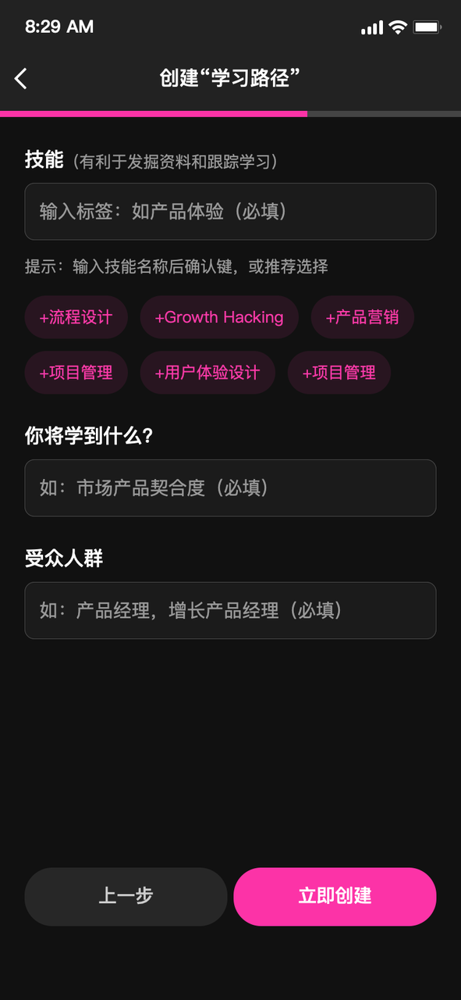
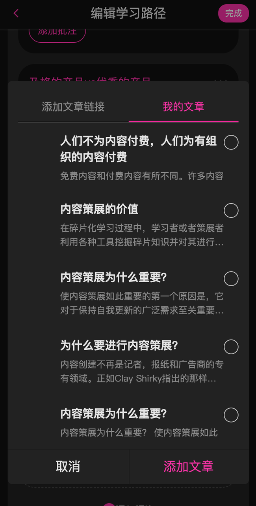

# 创作策展集（Pathway）

策展师申请成功后，即可解锁创建“学习路径”的权限。接下来只要按照本文的步骤提醒，就能创建属于自己的知识路径了。

## 一、如何进入氢舟Pathway创作页面？

1.扫描下方二维码或在微信搜索“氢舟Hypper”进入公众号

2.在公众号下方菜单找到“知识路径”一栏点击进入“策展集”页面。

3. 进入“策展集”页面后点击右下方“+新建学习路径”按钮，即可进入“新建学习路径”页面。

## 二、尝试创建一个Pathway吧

创建Pathway前，首先需要明确自己撰写pathway的目的和方向，每个pathway最好都有一个明确的主题，后续一切内容框架都围绕该主题展开。

**一、明确标题和引导页内容**

**撰写「主题策展」标题：**

通过标题体现本内容的核心亮点，需要清晰明确，可用“如何”句拟定标题

**1.用好“如何“句，以解决问题的思路来拟标题**

 · 如何组建创业团队  
 · 如何提升职场学习能力  
 · 如何设计好一门课程  
 · 如何成为一名优秀的产品经理

**2.用“指南”、“手册”等关键词强调指导性，突出对读者的帮助**

 · 私域运营指导手册   
 · HRBP职业进阶指南

**3.对于信息集合类主题策展，可以使用关键词强调内容的“全面”或“体系化”** 

 · Newsletter平台情报all in one   
 · 关于clubhouse的一切   
 · “新国货”BM系统图谱  

**撰写「主题策展」简介：**

· 可以谈谈策展主题的意义和价值  
· 告诉读者本条策展为什么值得看  
· 通过清晰的引导激发读者的兴趣

**样例：如何写好一个简介**

**1、突出主题的价值与重要性**  
· 只有精准把握北极星指标才能真正有效实现精益增长

**2、列举该主题策展值得一看的要点**  
· 本策展收集了来自Airbnb、阿里巴巴等多家企业资深产品经理的的独家洞见

**3、对读者的注意力和兴趣加以引导**  
· 一个指标撬动全局，帮你打造增长核武器

**上传「主题策展」封面图**  
点击「上传封面图」，选择一张不小于1280\*255的图片，作为整篇策展的封面，完成后点击“下一步”。

**封面图选择可以注意以下几点：**

 · 与主题相协调  
 · 整体美观合适  
 · 能吸引注意力  
 · 激发读者兴趣

**二、围绕主题，展开内容。**

**1、为主题策展设置「技能标签」：**  
· 标签能够使读者迅速找到自己需要的信息  
· 应当灵活简单，可被聚合与扩展  
· 优秀的tag系统方便作者更好地管理内容

**2、填写「将会学到什么」：**  
告诉读者通过学习本策展能够得到什么具体的收获

· 可运用“学会”或“收获”组织语句  
· 突出具体的“技能”、“知识”或“信息”  
· 强调本策展为读者提供的帮助是什么  

**3、填一下本策展受众人群：**  
· 可用职业、岗位、兴趣群体来描述受众人群  
· 技能类主题策展可描述将用到该技能的岗位  
· 知识类主题策展则可思考需要该信息的群体

完成上述步骤后，一个pathway主页便建立完成了，接下来会进入框架搭建环节。

**三、编辑Pathway主页结构**

内容策展框架设计，是Pathway创作中的一大重点环节，策展者思维方式、认知结构的内在价值都将在这个环节中得到体现。

**Pathway主页结构分为三级：**

* **章节：** Pathway中最大的板块，由多个课次组成，章节的内容是根据学习进程逐渐深入的。
  * 确定章节标题
  * 添加章节描述
* **课次：** 每一章下的单次课程，可以包含多个主题相关的内容板块。
  * 拟定章节内课次标题
  * 对每一课内容加以描述
* **内容：** 最小的完整学习单元，由策展人采集进来的公众号文章及Medium内容素材组成。
  * 采集并整理素材
  * 为素材添加技能标签
  * 点击“添加文章”按钮将素材加入对应的内容体系中

氢舟Pathway素材库由左侧的采集系统和右侧的素材存储两部分组成。

* **在左侧“添加文章链接”菜单可以通过粘贴文章URL**（目前支持微信公众号、Medium内容）将目标素材采集到库中：

* **在右侧“我的文章”菜单可以查看用户采集到的所有内容：**

* **可通过点击“添加文章”将其加入对应的课次中：**

在搭建Pathway结构时，可以通过由宏观到微观、先出框架再逐渐细化的形式来推进创作。氢舟Pathway支持实时更新，因而可以先创作大致章节架构，再细化到课次和内容。  
   
整体的“章-课-篇”的pathway架构完成后，则会进入到内容加工编辑环节。  

**四、内容加工**

Pathway的内容工具围绕氢舟HITA概念展开  
**Highlight**  
**Inspiration**  
**Takeway**  
**Action**  
   
策展师将路径文章萃取出的内容汇集到个人主页，动态包含所有的萃取的内容（划重点、写总结、行动建议、待办清单）基于文章和路径信息增加价值

* **为采集到的内容撰写「推荐语」：** 简要说说对本篇内容整体的点评与推荐介绍 · 围绕所采集到的当篇内容来做描述 · 应当具有概括性，能够体现当篇内容主题 · 突出本内容亮点和价值，尽量让读者产生期待 
* **为采集到的内容「写总结」：** 写下对本内容的归纳总结 · 可通过加序号的形式让总结更加有条理 · 帮助复习时快速回忆起本篇主要内容 · 作者和读者都可以写下自己的总结内容 
* **在文章里面「划重点」：** 将你认为重要的、有价值的句子段落作为重点划下来 
* **对划线句子写出你的「想法」：** 把自己对文中内容的灵感洞见分享给读者 · 写下作者原创性的读书批注，或对文中内容作出评论 · 通过启迪性的表达与读者相互激发思维 · 可以通过此功能对文中专业性或者晦涩的表达进行注释 
* **在最后给出你的「行动建议」：** 写下基于本篇内容的行动指导要点 · 可以将本篇内容之中“如何做”的部分精简提炼出来，作为一个简要的操作指南 · 可通过数字序号让指导更有条理，把行动的顺序和步骤呈现出来\| · 也可作为学习之后布置给读者的练习内容，巩固对内容的理解和掌握

**五、提交策展并设置定价**

完善的学习路径及信息萃取完成后，可给主题策展定价，提交氢舟平台审核，也可以对主题策展进行更新和再编辑，让认知不断的迭代升级。  

