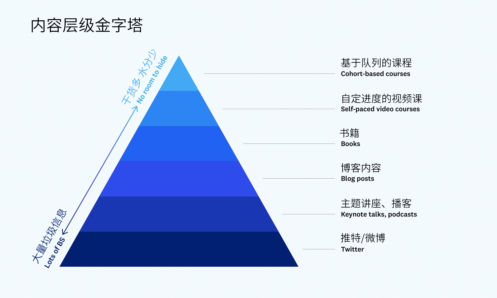
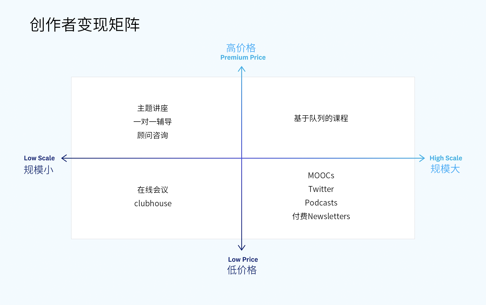

# Newsletter vs Pathway

## Newsletter

可以说，Newsletter开始流行的原因是，社交媒体的浮躁催生了一部分人脱离社交媒体寻找更高质量的内容源。不论对于创作者还是对于用户，Newsletter这种创作形式最大的价值便在于此（[Newsletter为啥又火了？](https://mp.weixin.qq.com/s/AAiTZPaeIvCLO37peJ9UJQ)）。

**从学习者的角度**

1.获得个性化的高质量内容，节省时间和精力。2.系统学习知识库

**从创作者的角度：**

**1. 降低了创作者的写作门槛：**newsletter 不是一篇原创的线性文章，而是多个主题笔记的聚合。

**2.良好的创作体验：**付费订阅模式可以让创作者通过专心创作内容为用户提供价值，而不用在乎广告主。

**3.获得长期稳定收入：**Newsletter方便创作者和用户建立情感联系，且可以完全掌握自己的读者数据，从而沉淀忠实用户，通过付费订阅获得长期稳定的收入。

**4.复利:**可以持续沉淀自己的过去的内容，变为知识库，将来的订阅用户会愿意为这些知识库付费。**国内**

\*\*\*\*

**Newsletter成功实践者**

* 2016年，前媒体人赵赛坡创建了Newsletter[Dailyio](https://iois.me/)，吸引了3000+订阅者，一共有五个产品，年订阅费分别为99元、500元、200元、200元、200元，没有广告，全靠优质的内容获得了忠实的用户。
* 2017年，前丁香园产品架构师少楠创建了Newsletter[产品沉思录](https://www.pmthinking.com)，吸引了2000+订阅者，他们每人每年支付199元，没有广告，每年收入数十万元。

## Pathway

在这个时代，信息足够多，也不缺乏好内容，虽然有算法来帮我们提升发现信息的效率，但是人的经验，洞见，以及个人对信息与知识的理解，和组织信息的角度是永远无法被机器所替代的。并且我们日常所接触到的信息也是碎片且孤立的，没有被基于主题或者关联性所组织起来。所以氢舟想提供以下价值

**从学习者与读者的角度：**

**1.以点盖面：**能够通过一个内容，去找到一个主题，一个体系，一个系列，点亮一个局部的小知识体系；

**2.更快理解：**能够通过策展者或者其他读者对内容的萃取，去快速的去了解一个内容的金句，精华，要点，最佳实践与行动建议；

**3.持续更新：**能够直接在内容主体里与策展人以及其他读者进行互动，也能同步看到策展对内容的补充与更新

**4.形成体系：**当然也能够基于不同主题/问题/洞见，去创建自己的知识/内容的策展清单，形成无数个属于自己的小知识体系；

**从知识策展师的角度：**

**1.更轻量的创作：**不需要去原创所有内容，在你擅长的领域，去基于一个主题/问题，将最优质的内容组织起来，从而去解决一个问题，去由浅到深的阐述一个主题；

**2.让内容增值：**通过氢舟原创的方法与工具，去萃取与提纯内容，这包括：划出重点，添加批注，总结出内容的核心概要，补充被内容所激发所想到的案例或者最佳实践，以及添加基于内容有价值的行动建议，让内容增加更多的价值；

**3.持续更新：**如果你发现了新的好内容，可以随时把它们补充或者更新到原有的知识清单，关注了这个清单的读者/学习者，也能随时收到这些内容的最近进展；

## Newsletter与Pathway的对比：

Newsletter，Learning pathway，这两款产品都有各自很明显的特显，也都是对信息的组织与加工，需要的信息原材料不一样，加工深度不一样，需要解决的问题目标不一样。

Creator的能力覆盖是可以从课程到Learning pathway，到Newsletter的。

| 对比维度 | Newsletter | Learning Pathway | Course |
| :--- | :--- | :--- | :--- |
| 用户画像 | 需要经常性获得优质情报与信息的人 | 有明确主题或者问题的人 | 需要达成或者掌握某个技能的人 |
|  | 懒得发掘信源，找信息，节省信息获取与筛选成本，以人为信源  | 能够快速帮一个不懂这个问题或者行业的人快速建立一个理解框架，以及这个主题下的重点知识  | 掌握技能，深度，体系化的知识与洞见 |
|  | 人 | 问题/内容 | 人+内容+结果 |
|  | 无明确目标与主题，信息实时性强，内容组织方式灵活，信息领域与挖掘方向从creator本身出发 | 目标明确，受众明确，有相对固定的格式与模版 | 需要在一个领域有丰富的实践与理论经验，该领域的专家，可以设计出成熟可靠的系统框架等 |
|  | 长期投入 | 一次性短期投入，可以不断更新内容 | 一次性重投入 |
|  | 创作者自身，灵感启发 | 市场需求 |  |
|  | 是 | 是 | 是 |
| 原材料 | 注释、文/书、引用卡片、引文、评论、链接、内嵌媒体、社群提问、洞察 | 整体内容（文章、视频、播客、书籍、文档...） | 书籍、论文 |
|  | 引用申明 | 引用申明 | 引用申明 |
|  |  |  |  |

