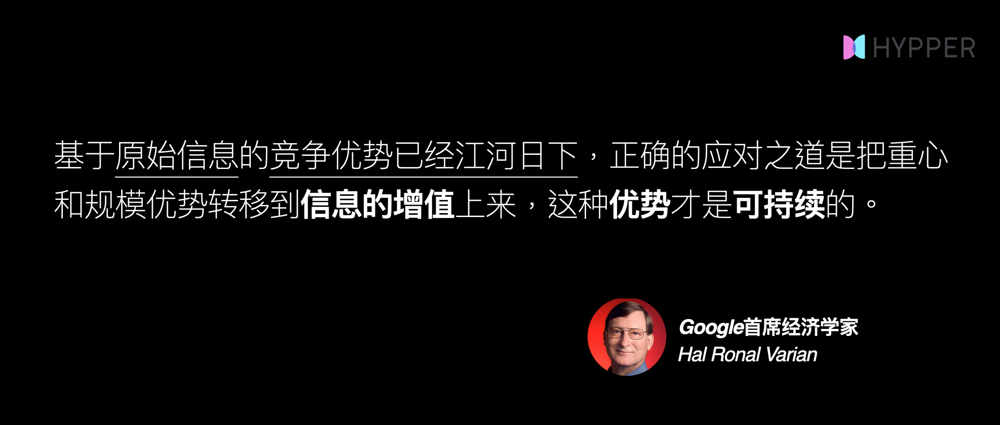

# 什么是内容策展?

### 1.来自艺术领域的「策展Curation」概念

从词源上，Curation是策划，筛选并展示的意思。在最早的时候，这个词指的是艺术展览活动中的构思、组织和管理工作。一个艺术品展览的策展人要策划一个好的展览，有以下几个步骤：

1. 寻找最好的艺术品 

2. 验证和保存艺术品 

3. 根据策展主题把这些艺术品组合在一起 

4. 添加解释，描述和含义 

5.公开向人们展示

### 2.什么是「内容策展」？

**主题式策展：**可以是围绕特定的主题，并按照一定的逻重去寻找，验证，重新组织，萃取，加工这些内容，然后向他人展示，并给他人带来价的过程就叫「内容策展」。这种基于主题的内容策展，用「Pathway」这样的集合形式最好不过了。



**周期型策展：**当然你会问，没有主题可以吗？当然可以，其实**时间周期本身就是一个非常好的主题**，比如说周刊，双周刊，半月刊，月刊基于一个时间段，把这个时间段里所看到的各种优质内容做一个集合，可以是一个图片，视频，一个思维，一些内容的片段截取，对话，金句等等的集合，都是基于时间维度的「内容策展」，「Newsletter」简报就是危这样的场景而生的。



你在进行内容策展时，可以把自己想成是一个博物馆的馆长或者是一个策展人，策划主题、优选单品、组织单品，萃取精华，添加解释，描述和含义，并展示给对应的人，能他们带来价值。

### 3.「内容策展师」所需要的三个核心能力

如同对艺术品审美一般，做好「内容策展」，需要三个核心能力：

**第1个：**是「信息品味」或者也可以叫「信息审美」能力，从海量的信息中鉴别优质信息的能力；

**第2个：**是「信息品鉴」，能够在一个优质内容中捕捉到最有价值的那些洞见与信号；

**第3个：**是「增值能力」，你能对原始信息进行丰满、补充和增加更多的附加价值。

当你拥有在在某个领域长期沁润，并具备丰富的知识，品味，经验，洞见时，在这个领域的基础信息品味就具备了。

### 4.内容策展的价值

当我们不可能从信息洪流中吸收所有东西时，我们能做的最好的事情**就是挑选出对我们最重要的东西**，这个时候策展师\(Curators\)的价值就显现了：因为他们能帮我们挑选到适合自己品味的内容，这也就是各种付费 Newsletter在国外掀起，知识付费在国内兴起的原因。

**节省时间：**策展通过经专家或达人的筛选、整理和组织的重点资源、信息和工具纳入某个特定主题，从而节省了人们的时间。

**深入理解特定主题：**策展通过收集和关联有关该主题的优选信息，引导对这个主题有兴趣的人更深入地理解它。

**深入学习特定主题：**策展可以帮助个人更好地、更深入地学习任何主题。因为策展的过程是动态的、不确定的，精挑细选和某个主题相关的信息，可以促进人们不断地提问、参与和改进。

**发现有价值的信息：**策展能够发现新的、罕见的或未知的有价值的资源，否则这些信息资源有可能不会被大家注意到。

**生成新的内容：**策展师重要的信息管理活动，它把未经验证的、杂乱的信息重新组合在一起，生成新的结构和内容。

**提供更全面的整体观点：**策展可以提供对任何主题的批判性思维以及更全面的整体观点，而不是简单的非白即黑的观点。

由此可见，策展的核心功能就在于把零散的优质单品，围绕主题重新组织，创造新的价值。而对于学习者来讲，在浏览一篇优质的内容时，同时也能顺着它找到一个小体系，去逐渐点亮属于你的知识网络。

Google首席经济学家Hal Ronal Varian说到：

